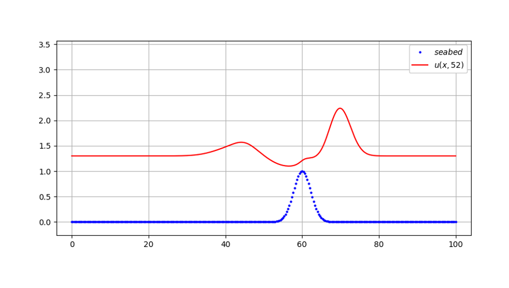

## hyper_pde_1d_travelwave

Hyperbolic partial differential equation solver: visualization of 1-dimensional travelling wave (for teaching purposes)

### Wave Equation with Non-constant Wavespeed

The scripts in this repository are used to solve and visualize the hyperbolic Partial Differential Equation (PDE) governing the motion of a tsunami (or similar) in the open
ocean, in the case of a variable height seabed:  

  

with *u(x, t)* the non-dimensional sea surface height and *h(x)* the non-dimensional still-water height (see figure below).  

  

The initiation of the tsunami (e.g. a subsea earthquake) can be modelled by the initial displacement  

  

centered at *x*1, with (additional) sea surface height <i>&alpha;</i>1 and spread <i>&sigma;</i>1. The subsea hill (or depression) is modelled as  

  

with the center at *x*B, the elevation &alphaB and the spread &sigmaB. To model infinite spatial domains, an open boundary at *x* = 0 respectively at *x* = L given by the condition  

  

is implemented.  

### Solution and Visualization

The hyperbolic PDE is solved employing finite difference methods. To model, solve and visualize the hyperbolic PDE for time *t*, use the files `pde_hyper_1Dtravelwave.py` and `pde_DEMO_1Dtravelwave.py`.  

  

For an animated solution, use file `pde_hyper_1Dtravelwave_anim.py` (`pde_hyper_1Dtravelwave.py` is imported and used for solving the PDE for a certain time frame).

